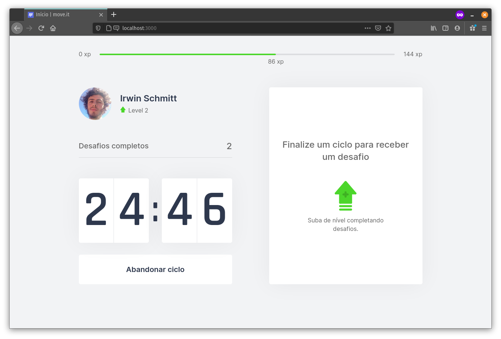
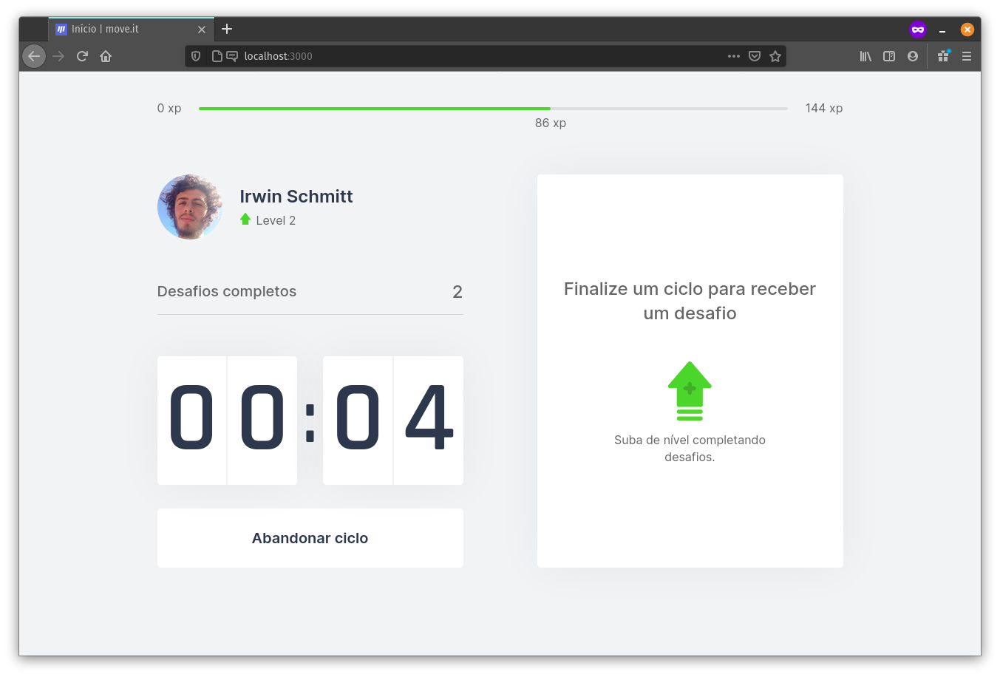
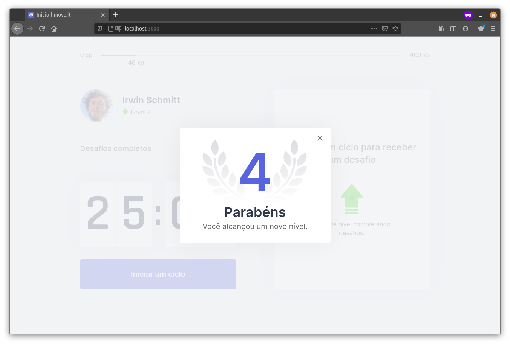

<a href="https://nextlevelweek.com/" target="_blank">
    
</a>

# Move<span/>.it


###  [`Português (Brasil)`](https://github.com/irwinschmitt/nlw4/blob/main/README.md)

Move<span></span>.it is the
<a href="https://en.wikipedia.org/wiki/Gamification" target="_blank">gamification</a>
of the
<a href="https://en.wikipedia.org/wiki/Pomodoro_Technique" target="_blank">Pomodoro Technique</a>
in order to exercise the body for long periods writing code.

The project was developed during the
<a href="https://nextlevelweek.com/" target="_blank">`Next Level Week #4`</a>
with guidance from
<a href="https://github.com/Rocketseat" target="_blank">@Rocketseat</a>.

> **Gamification** is the application of game-design elements and game principles in non-game contexts.

> The **Pomodoro Technique** is a time management method that uses a timer to break down work into intervals, traditionally 25 minutes in length, separated by short breaks.

## Demo

Check out the app:
<a href="https://moveit-irwin.vercel.app/" target="_blank">moveit-irwin.vercel.app</a>.

## Usage

On the home screen it is possible to `start a work cycle`.

<p align="center">
    
    
</p>

When the timer reaches **zero**, the user will receive a notification with a new challenge to exercise the body.

<p align="center">
    
    
</p>

If the user completes the challenge, they will earn the experience (*xp*) of the challenge, being able to level up.

<p align="center">
    
</p>

## Technologies

###  React

###  TypeScript

###  Next.js

## Roadmap

`TODO`

## Running locally in development mode

1. Install the dependencies.

```bash
yarn
```

2. Start the app.

```bash
yarn dev
```

3. The app should now be up and running at
<a href="http://localhost:3000/" target="_blank">http://localhost:3000/</a>. 🚀

