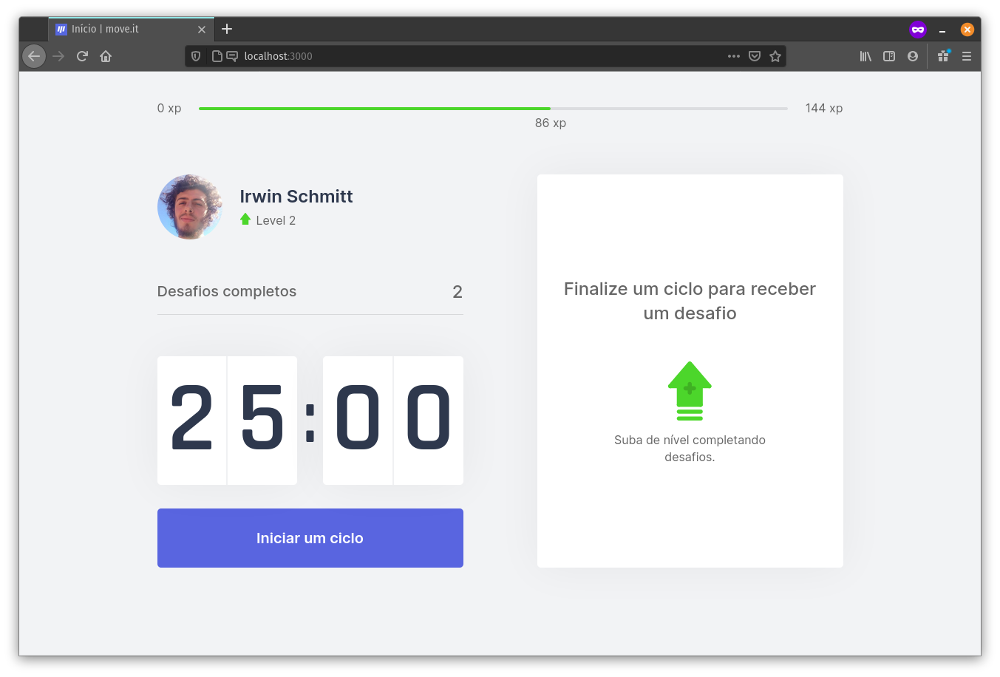
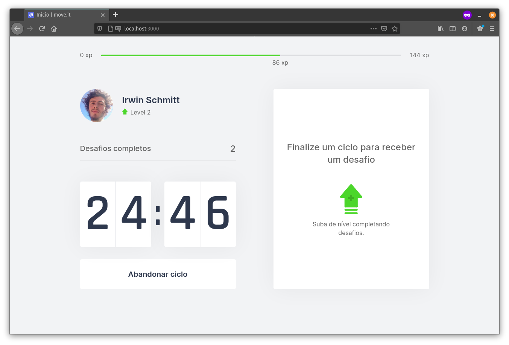
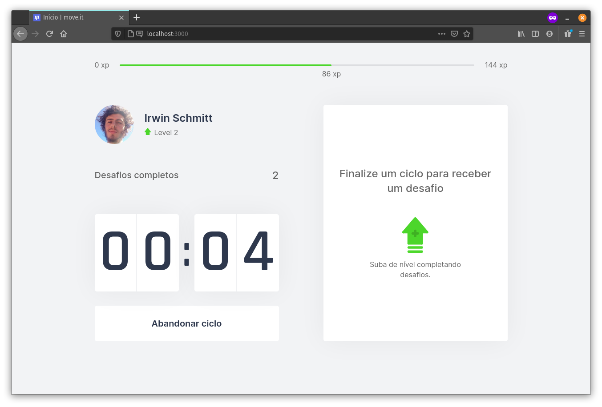
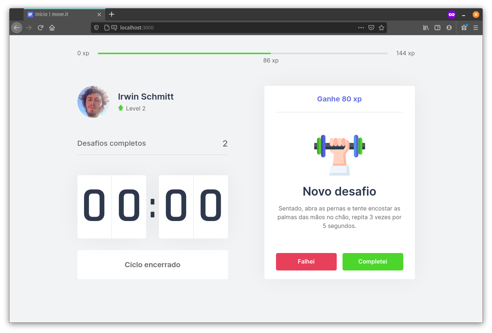
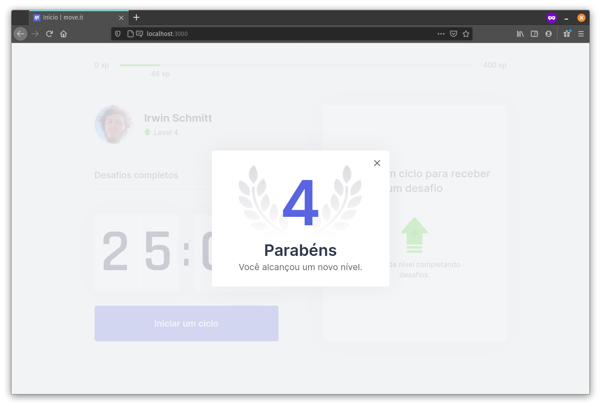

<a href="https://nextlevelweek.com/" target="_blank">
    
</a>

# Move<span/>.it


Move<span></span>.it é a
<a href="https://pt.wikipedia.org/wiki/Ludifica%C3%A7%C3%A3o" target="_blank">gamificação</a>
da
<a href="https://pt.wikipedia.org/wiki/T%C3%A9cnica_pomodoro" target="_blank">Técnica Pomodoro</a>
com o objetivo de exercitar o corpo durante longos períodos escrevendo código.

O projeto foi desenvolvido durante a
<a href="https://nextlevelweek.com/" target="_blank">`Next Level Week #4`</a>
com orientações da
<a href="https://github.com/Rocketseat" target="_blank">@Rocketseat</a>.

> **Gamificação** é o uso de técnicas que utilizam mecânicas e pensamentos orientados a jogos para enriquecer contextos diversos normalmente não relacionados a jogos.

> A **Técnica Pomodoro** é um método de gerenciamento de tempo que consiste na utilização de um cronômetro para dividir o trabalho em períodos de 25 minutos, separados por breves intervalos.

## Demonstração

Confira a aplicação em:
<a href="https://moveit-irwin.vercel.app/" target="_blank">moveit-irwin.vercel.app</a>.

## Uso

Na tela inicial é possível `iniciar um ciclo` de **25 minutos**.

<p align="center">
    
    
</p>

Quando o temporizador chegar a **zero**, o usuário receberá uma notificação e um *beep* com um novo desafio para exercitar o corpo.

<p align="center">
    
    
</p>

Se o usuário conseguir completar o desafio, ganhará a experiência (*xp*) do desafio, podendo subir de nível.

<p align="center">
    
</p>

## Tecnologias

###  React

###  TypeScript

###  Next.js

## Funcionalidades

`TODO`

## Instalação

1. Instale as dependências.

```bash
yarn
```

2. Inicie servidor de desenvolvimento.

```bash
yarn dev
```

3. Por padrão, acesse a aplicação em
<a href="http://localhost:3000/" target="_blank">http://localhost:3000/</a>.

